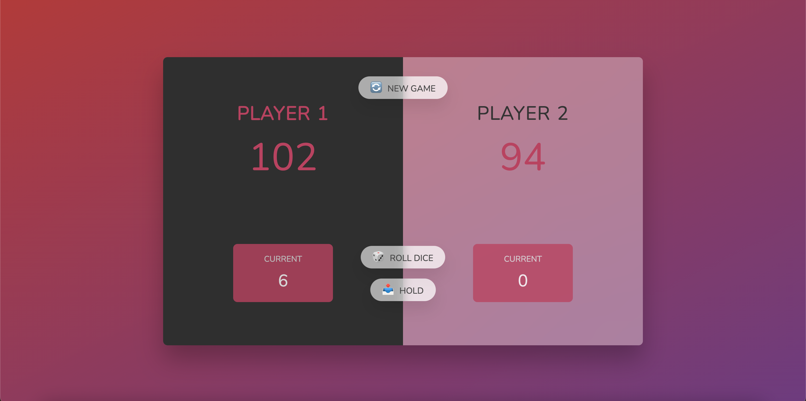

# Dice Game in JavaScript 🎲

[Dice Game Preview]

Welcome to my Dice Game project! This fun and interactive game is designed to help you learn JavaScript by coding it. 🚀

## Table of Contents 📜

- [Demo](#demo) 🎮
- [Features](#features) ✨
- [How to Play](#how-to-play) 🎯
- [Rules](#rules) 📜
- [Reset](#reset) ♻️
- [Technical Details](#technical-details) 💻
- [Contributing](#contributing) 🤝
- [License](#license) 📄

## Demo 🎮

🔗 You can play the Dice Game by visiting the [Demo Page](https://your-demo-link-here.com).

## Features ✨

🎲 Two players can take turns rolling dice.

📊 The game keeps track of each player's current score and total score.

🔄 Rolling a one resets the current player's score and switches to the next player.

🏆 The first player to reach a score of 100 wins!

🔄 A Reset button is available to start a new game.

## How to Play 🎯

1️⃣ Two players take turns rolling the dice by clicking the "Roll" button.

2️⃣ The current player's score is displayed on the screen.

3️⃣ Click "Hold" to add the current score to the player's total score. It's the next player's turn.

4️⃣ If a player rolls a one, their current score becomes zero, and it's the next player's turn.

5️⃣ The first player to reach a total score of 100 wins the game.

## Rules 📜

🚫 Rolling a "1" will reset the current player's score to zero, and it's the next player's turn.

✅ Clicking "Hold" will add the current score to the total score, and it becomes the next player's turn.

## Reset ♻️

🔄 You can start a new game at any time by clicking the "New Game" button. This resets all scores and starts a fresh game.

## Technical Details 💻

🛠️ The Dice Game is built using HTML, CSS, and JavaScript. It includes DOM manipulation and various JavaScript functions to control the game logic and user interactions.

## Contributing 🤝

🤗 Contributions are welcome! If you'd like to contribute to this project, please fork the repository and submit a pull request.

## License 📄

⚖️ This project is open-source and available under the [MIT License](LICENSE). Feel free to use, modify, and share it!
